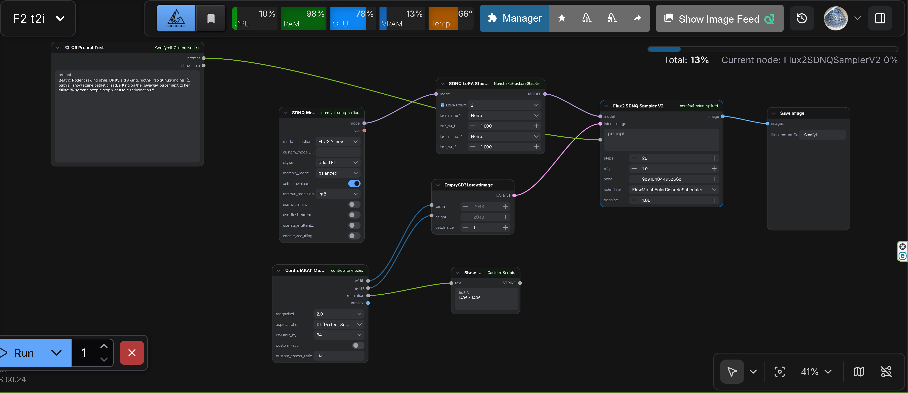

# ComfyUI-SDNQ-Splited

> **This repository is a fork of [EnragedAntelope/comfyui-sdnq](https://github.com/EnragedAntelope/comfyui-sdnq)**

## Acknowledgments

We would like to express our deepest gratitude to **EnragedAntelope**, the creator of the original [comfyui-sdnq](https://github.com/EnragedAntelope/comfyui-sdnq) repository. This modular node structure would not have been possible without their foundational work. In particular, we are especially grateful for their development of the dedicated scheduler implementation, which has been instrumental in enabling this fork's split-node architecture. Thank you for your excellent work and for making this project possible.

---

**Load and run SDNQ quantized models in ComfyUI with 50-75% VRAM savings!**

This custom node pack enables running [SDNQ (SD.Next Quantization)](https://github.com/Disty0/sdnq) models directly in ComfyUI. **This repository implementation is developed specifically for FLUX.2 only**. Run FLUX.2 models on consumer hardware with significantly reduced VRAM requirements while maintaining quality.

> **SDNQ is developed by [Disty0](https://github.com/Disty0)** - this node pack provides ComfyUI integration.

> **⚠️ Important**: **This repository is developed specifically for FLUX.2 only**. While SDNQ technology supports other large-scale models (FLUX.1, Qwen Image, etc.), this implementation focuses on FLUX.2. Other models have not been tested.

## Modular Node Structure

This fork provides a **modular node structure with split functionality**. The following nodes are implemented:

- **SDNQ Model Loader**: Dedicated node for loading models
- **SDNQ LoRA Loader**: Dedicated node for loading LoRAs (also available as **SDNQ LoRA Stacker V2** in [ComfyUI-NunchakuFluxLoraStacker](https://github.com/ussoewwin/ComfyUI-NunchakuFluxLoraStacker) with dynamic 10-slot UI)
- **SDNQ VAE Encode**: Dedicated node for encoding images to latent space (compatible with diffusers VAE)
- **SDNQ Sampler V2**: Dedicated node for image generation (general models)
- **Flux2 SDNQ Sampler V2**: Dedicated node for image generation (Flux2-optimized)

This allows you to use SDNQ models with the same workflow structure as standard ComfyUI workflows (Model Load → LoRA Apply → Sampling).

---

## Features

- **🔀 Modular Node Structure**: Functionality split into separate nodes (Model Loader, LoRA Loader, Sampler) - compatible with standard ComfyUI workflows
- **📦 Model Catalog**: 30+ pre-configured SDNQ models with auto-download (note: at the moment, development is focused on FLUX.2 compatibility)
- **💾 Smart Caching**: Download once, use forever
- **🚀 VRAM Savings**: 50-75% memory reduction with quantization
- **⚡ Performance Optimizations**: Optional xFormers, Flash Attention (FA), Sage Attention (SA), VAE tiling, SDPA (automatic)
- **🎯 LoRA Support**: Load LoRAs from ComfyUI loras folder via dedicated loader node
- **📅 Scheduler Support**: FlowMatchEulerDiscreteScheduler for FLUX.2 models
- **🔧 Memory Modes**: GPU (fastest), balanced (12-16GB VRAM), lowvram (8GB VRAM)

---

## Installation

```bash
cd ComfyUI/custom_nodes/
git clone https://github.com/ussoewwin/comfyui-sdnq-splited.git
cd comfyui-sdnq-splited
pip install -r requirements.txt
```

Restart ComfyUI after installation.

---

## Quick Start

### Using Split Nodes (Recommended - Modular Workflow)

1. Add **SDNQ Model Loader** node (under `loaders/SDNQ`)
2. Add **SDNQ LoRA Loader** node (optional, under `loaders/SDNQ`)
3. Add **SDNQ VAE Encode** node (under `latent/SDNQ`) for image-to-image workflows (optional)
4. Add **SDNQ Sampler V2** node (under `sampling/SDNQ`) or **Flux2 SDNQ Sampler V2** node (under `sampling/SDNQ/Flux2`) for Flux2 models
5. Connect Model Loader → LoRA Loader → (VAE Encode) → Sampler
6. Select model from dropdown (auto-downloads on first use)
7. Enter your prompt and click Queue Prompt

---

## Sample Workflows

### Text-to-Image (t2i) Workflow

A complete example workflow demonstrating Flux2 text-to-image generation with SDNQ models.

**Files:**
- Workflow JSON: [`jsons/F2 t2i.json`](jsons/F2%20t2i.json)



**Required Additional Nodes:**

This workflow requires the following additional custom nodes:

1. **[ComfyUI-NunchakuFluxLoraStacker](https://github.com/ussoewwin/ComfyUI-NunchakuFluxLoraStacker)**
   - Required for LoRA loading functionality in the workflow
   - Install via ComfyUI Manager or manually clone to `custom_nodes/`

2. **[ControlAltAI-Nodes-fixed-Python3.13](https://github.com/ussoewwin/ControlAltAI-Nodes-fixed-Python3.13)**
   - Required for additional workflow features
   - Install via ComfyUI Manager or manually clone to `custom_nodes/`

**Usage:**
1. Install the required additional nodes listed above
2. Load the workflow JSON file (`F2 t2i.json`) in ComfyUI
3. Adjust model, prompts, and parameters as needed
4. Click "Queue Prompt" to generate

---

## Node Reference

### SDNQ Model Loader

**Category**: `loaders/SDNQ`

**Main Parameters**:
- `model_selection`: Dropdown with 30+ pre-configured SDNQ models
- `custom_model_path`: For local models or custom HuggingFace repos
- `memory_mode`:
  - `gpu` = Full GPU (fastest, 24GB+ VRAM required)
  - `balanced` = CPU offloading (12-16GB VRAM)
  - `lowvram` = Sequential offloading (8GB VRAM, slowest)
- `dtype`: bfloat16 (recommended), float16, or float32

**Outputs**: `MODEL` (connects to SDNQ Sampler V2 or other SDNQ nodes)

---

### SDNQ LoRA Loader

**Category**: `loaders/SDNQ`

**Main Parameters**:
- `lora_selection`: Dropdown from ComfyUI loras folder
- `lora_custom_path`: Custom LoRA path or HuggingFace repo
- `lora_strength`: -5.0 to +5.0 (1.0 = full strength)
- `model`: Input from SDNQ Model Loader

**Outputs**: `MODEL` (connects to SDNQ Sampler V2)

**Note**: For advanced LoRA stacking with dynamic 10-slot UI, see [SDNQ LoRA Stacker V2](https://github.com/ussoewwin/ComfyUI-NunchakuFluxLoraStacker) in the ComfyUI-NunchakuFluxLoraStacker repository.

**Note**: This node is for FLUX.2 only. While SDNQ supports other large-scale models (FLUX.1, Qwen Image, etc.), this implementation focuses on FLUX.2 only. Other models have not been tested.

---

### SDNQ Sampler V2

**Category**: `sampling/SDNQ`

**Main Parameters**:
- `model`: Input from SDNQ Model Loader or SDNQ LoRA Loader
- `prompt` / `negative_prompt`: What to create / what to avoid
- `steps`, `cfg`, `width`, `height`, `seed`: Standard generation controls
- `scheduler`: FlowMatchEulerDiscreteScheduler (FLUX.2 only)

**Performance Optimizations** (optional):
- `use_xformers`: Memory-efficient attention (safe to try, auto-fallback to SDPA)
- `use_flash_attention`: Flash Attention (FA) for faster inference and lower VRAM
- `use_sage_attention`: Sage Attention (SA) for optimized attention computation
- `enable_vae_tiling`: For large images >1536px (prevents OOM)
- SDPA (Scaled Dot Product Attention): Always active - automatic PyTorch 2.0+ optimization

**Outputs**: `IMAGE` (connects to SaveImage, Preview, etc.)

**Note**: This node is for FLUX.2 only. While SDNQ supports other large-scale models (FLUX.1, Qwen Image, etc.), this implementation focuses on FLUX.2 only. Other models have not been tested.

---

### Flux2 SDNQ Sampler V2

**Category**: `sampling/SDNQ/Flux2`

**Purpose**: Flux2 models (FLUX.2-dev, FLUX.1-dev, etc.) with specialized optimizations for Flow Matching architecture.

**Main Parameters**:
- `model`: Input from SDNQ Model Loader or SDNQ LoRA Loader (must be Flux2 pipeline)
- `prompt`: Text prompt for generation
- `steps`, `cfg`, `seed`: Standard generation controls
- `latent_image`: Latent input from SDNQ VAE Encode (supports i2i workflows)
- `denoise`: Denoising strength (0.0-1.0) - controls initial noise level via sigma schedule
- `scheduler`: FlowMatchEulerDiscreteScheduler (only supported scheduler for Flux2)

**Flux2-Specific Optimizations**:
- **Flow Matching Support**: Specialized implementation for Flux2's Flow Matching architecture
- **Advanced i2i Processing**: 
  - Initializes latents from input image using `pipeline._encode_vae_image()`
  - Uses sigma schedule (`sigmas`) to control denoise strength accurately
  - Properly handles `compute_empirical_mu` and `retrieve_timesteps` for Flux2
- **VAE Compatibility**: Patches VAE.decode to force float32 input (prevents dtype mismatches with Flux2 VAE)
- **Accurate Denoise Control**: Unlike standard samplers, maintains full step count while adjusting initial noise level via sigma schedule

**When to Use**:
- **Recommended** for all Flux2 models (FLUX.2-dev, FLUX.1-dev, FLUX.1-schnell, etc.)
- Provides better i2i (image-to-image) results with Flux2 compared to generic SDNQ Sampler V2
- More accurate denoise control for Flux2's Flow Matching architecture

**Outputs**: `IMAGE` (connects to SaveImage, Preview, etc.)

**Note**: This node is specifically optimized for FLUX.2 pipelines only. Other models have not been tested.

---

## Available Models

**FLUX.2 models only** - Other models have not been tested.

Pre-configured FLUX.2 models include:
- FLUX.2-dev (various quantization levels)

Models are available in uint4 (max VRAM savings) or int8 (best quality). Browse SDNQ quantized models: https://huggingface.co/collections/Disty0/sdnq

**⚠️ Important**: **This repository supports FLUX.2 models only**. While SDNQ technology supports other large-scale models (FLUX.1, Qwen Image, etc.), this implementation focuses on FLUX.2 only. Other models have not been tested.

---

## Performance Tips

**For All Memory Modes**:
- SDPA (Scaled Dot Product Attention) is always active - automatic PyTorch 2.0+ optimization
- Enable the xFormers option in the UI (safe to try)
- Enable the Flash Attention (FA) option in the UI - faster inference and lower VRAM
- Enable the Sage Attention (SA) option in the UI - optimized attention computation
- Use `enable_vae_tiling=True` for large images (>1536px) to prevent OOM

**Scheduler Selection**:
- FLUX.2: Use `FlowMatchEulerDiscreteScheduler` (only scheduler supported)
- Wrong scheduler = broken images!

---

## Model Storage

Downloaded models are stored in:
- **Location**: `ComfyUI/models/diffusers/sdnq/`
- **Format**: Standard diffusers format

Models are cached automatically - download once, use forever!

---

## Troubleshooting

### xFormers Not Working

If you see "xFormers not available" but have it installed:
- This is usually fine - the node automatically falls back to SDPA (PyTorch 2.0+ default)
- SDPA provides good performance without xFormers
- If xFormers is incompatible with your GPU/model, fallback is automatic

### Out of Memory

1. Use lower memory mode (gpu → balanced → lowvram)
2. Use more aggressive quantization (uint4 instead of int8)
3. Reduce resolution or batch size
4. Enable `enable_vae_tiling=True` for large images

### Model Loading Fails

1. Check internet connection (for auto-download)
2. Verify repo ID is correct for custom models
3. For local models, ensure path points to directory (not a file)
4. Check model is actually SDNQ-quantized (from Disty0's collection)

---

## Technical Information

### Standard KSampler vs SDNQSamplerV2 Comparison

A detailed comparison document explaining the architectural and functional differences between the standard ComfyUI KSampler and SDNQSamplerV2 implementations, including denoise control mechanisms, image-to-image processing, and Flux2 support.

See: [COMPARISON_TABLE.md](md/COMPARISON_TABLE.md)

### Standard ComfyUI LoRA Loader vs SDNQ LoRA Loader Comparison

A comprehensive technical explanation comparing the standard ComfyUI LoRA Loader and SDNQ LoRA Loader, covering architecture differences (ModelPatcher vs DiffusionPipeline), LoRA application mechanisms (patches vs adapters), multiple LoRA processing methods (sequential vs parallel), and detailed implementation comparisons.

See: [LoRA_Loader_Comparison_Standard_vs_SDNQ_EN.md](md/LoRA_Loader_Comparison_Standard_vs_SDNQ_EN.md)

---

## Contributing

Contributions welcome! Please:
1. Follow existing code style
2. Test with multiple model types
3. Update documentation for new features

---

## License

Apache License 2.0 - See [LICENSE](LICENSE)

This project integrates with [SDNQ by Disty0](https://github.com/Disty0/sdnq).

---

## Credits

### Original Repository
- **Original ComfyUI-SDNQ**: [EnragedAntelope/comfyui-sdnq](https://github.com/EnragedAntelope/comfyui-sdnq)
- This repository is a fork with modular node structure (split functionality)

### SDNQ - SD.Next Quantization Engine
- **Author**: Disty0
- **Repository**: https://github.com/Disty0/sdnq
- **Pre-quantized models**: https://huggingface.co/collections/Disty0/sdnq

This node pack provides ComfyUI integration for SDNQ. All quantization technology is developed and maintained by Disty0.
